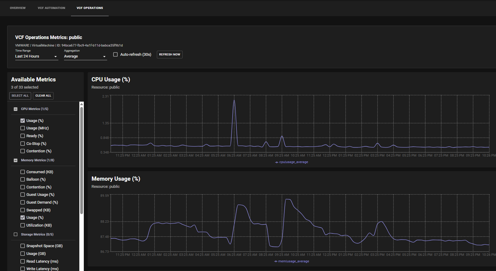

# VCF Operations Plugins

The VCF Operations plugins provide comprehensive observability and metrics monitoring capabilities for VMware Cloud Foundation (VCF) environments within Backstage. These plugins enable teams to monitor infrastructure performance, analyze resource utilization, and visualize operational metrics through an intuitive interface integrated with VCF Operations (vRealize Operations).

## Features

- **Performance Metrics Monitoring**: Real-time visualization of CPU, memory, disk, and network metrics
- **Categorized Metrics**: Organized metric selection with categories for CPU, Memory, Storage, Network, System Health, and Alerts
- **Multi-Resource Support**: Support for VMs (standalone and non-standalone), Supervisor Namespaces, projects, and Kubernetes clusters
- **Interactive Charts**: Time-series charts with customizable time ranges and aggregation options
- **Automatic Resource Detection**: Intelligent detection of VCF Operations resources based on entity metadata
- **Auto-refresh Capabilities**: Configurable automatic refresh with manual refresh options
- **Multi-Instance Support**: Support for multiple VCF Operations instances with instance selection
- **Permission Controls**: Access control integration with Backstage permissions
- **Dark Mode Support**: Full compatibility with light and dark themes
- **Collapsible Categories**: Organized metric categories with expand/collapse functionality
- **Resource-Specific Metrics**: Tailored metric sets for different resource types (VMs, projects, clusters, namespaces)

## Architecture

The VCF Operations plugin suite consists of three complementary packages:

### Frontend Plugin (`vcf-operations`)
- **VCFOperationsExplorer Component**: Main metrics visualization interface
- **Categorized Metrics Selection**: Left panel with organized metric categories
- **Interactive Charts**: Right panel with scrollable time-series charts
- **Smart Controls**: Top control bar with time range, aggregation, and refresh options

### Backend Plugin (`vcf-operations-backend`)
- **VCF Operations API Integration**: Direct communication with VCF Operations APIs
- **Authentication Management**: Token-based authentication with automatic refresh
- **Resource Discovery**: Intelligent resource lookup and mapping
- **Metrics Data Processing**: Time-series data retrieval and transformation
- **VCF 9 Support**: Compatible with VCF Operations v9 (any-apps tenants only)

### Common Library (`vcf-operations-common`)
- **Permission Definitions**: Shared permission model for access control
- **Type Definitions**: Common interfaces and types across plugins

## Screenshots

### Metrics Explorer Interface


The main interface features:
- **Top Control Bar**: Time range, aggregation, and refresh controls
- **Left Panel**: Categorized metrics with select/deselect capabilities
- **Right Panel**: Interactive charts with real-time data visualization

### Category-Based Metric Selection

Features organized metric categories with **collapsible sections** (all collapsed by default):
- **CPU Metrics**: Usage %, MHz, Ready time, Co-Stop, Demand, Entitlement
- **Memory Metrics**: Usage %, Consumed KB, Contention, Swap rates, Workload
- **Storage Metrics**: Disk Usage %, Datastore Usage %, Latency metrics
- **Network Metrics**: Usage KBps, Transmit/Receive rates, Dropped packets
- **System Health**: Health scores, badges (compliance, efficiency, health, risk, workload), availability
- **Alerts & Monitoring**: Alert counts by severity (critical, warning, info, immediate)
- **Capacity Analytics**: Remaining capacity %, time remaining, recommended sizes (clusters only)
- **Cost Metrics**: MTD costs, metering, billing information (projects only)
- **Power & Environment**: Power usage (VMs only)

### Real-Time Performance Charts

Interactive time-series visualization with:
- Configurable time ranges (1 hour to 30 days)
- Multiple aggregation options (Average, Min, Max, Sum, Latest)
- Responsive charts with zoom and tooltip capabilities
- Automatic data refresh options

## Supported Resource Types

### Virtual Machines
- **Standalone VMs**: Resources with `kind:virtualmachine` and `standalone-resource` tags
- **Non-Standalone VMs**: Resources with `kind:virtualmachine` tag (extracts VM name from console links)
- **Metrics**: CPU, memory, storage, network, system health, alerts, power consumption
- **Query Method**: Direct API search by VM name with VMWARE adapter filter

### Supervisor Namespaces  
- **CCI Namespaces**: Components with `spec.type: "CCI.Supervisor.Namespace"`
- **Alternative Detection**: Resources with `terasky.backstage.io/vcf-automation-cci-namespace-endpoint` annotation
- **Metrics**: Health badges, hardware config, CPU/memory usage, pod/VM counts, alerts
- **Query Method**: Property-based search or URN-based lookup

### VCF Automation Projects
- **Project Domains**: Domain entities with `spec.type: "vcf-automation-project"`  
- **Metrics**: Health badges, cost tracking (MTD costs, metering), resource usage, alerts
- **Query Method**: POST query to VCF Operations with ProjectAssignment search
  ```json
  {
    "name": ["projectName"],
    "adapterKind": ["VCFAutomation"], 
    "resourceKind": ["ProjectAssignment"]
  }
  ```

### Kubernetes Clusters
- **Cluster Components**: Resources with `kind:cluster` tag
- **Standalone Support**: Removes "(Standalone)" suffix if `standalone-resource` tag present
- **Metrics**: Health badges, capacity analytics, CPU/memory workload, VM summaries
- **Query Method**: POST query to VCF Operations with ResourcePool search
  ```json
  {
    "name": ["clusterName"],
    "adapterKind": ["VMWARE"],
    "resourceKind": ["ResourcePool"] 
  }
  ```

### Planned Support
- **VCF Automation 8 based entities Support**: Legacy VCF Operations v8 compatibility (in development)
- **VM-Apps Tenants**: VCF 9 vm-apps tenant support (in development)
- **Deployments**: VCF Automation Deployments support (future enhancement)

## VCF Version Compatibility

### Currently Supported
- **VCF 9**: Any-apps tenants only
- **VCF Operations v9**: Full API compatibility

### Limitations  
- **VCF 8**: Not currently supported (in development)
- **VCF 9 VM-Apps Tenants**: Not currently supported (in development)

The plugin is specifically designed and tested for VCF 9 environments with any-apps tenant configurations. Support for VCF 8 and VCF 9 vm-apps tenants is being actively developed.

## Configuration Example

```yaml
vcfOperations:
  instances:
    - name: vcf-ops-prod
      baseUrl: 'https://vcf-ops.company.local'
      majorVersion: 9  # VCF 9 with any-apps tenants
      relatedVCFAInstances:
        - vcfa-instance-name
      authentication:
        username: 'admin'
        password: 'VMware123!VMware123!'
    - name: vcf-ops-dev
      baseUrl: 'https://vcf-ops-dev.company.local'
      majorVersion: 9  # VCF 9 with any-apps tenants
      authentication:
        username: 'monitoring'
        password: 'SecurePassword123!'
```

## Component Usage

### As a Tab Component
Add the VCF Operations Explorer as a tab to entity pages:

```typescript
import { VCFOperationsExplorerComponent } from '@terasky/backstage-plugin-vcf-operations';

// In your entity page
    <EntityLayout.Route path="/vcf-automation" title="VCF Automation">
      <VCFAutomationCCIResourceDetails />
    </EntityLayout.Route>
```
  
## Key Benefits

1. **Unified Observability**: Single interface for monitoring VCF infrastructure metrics
2. **Context-Aware**: Automatically detects and displays relevant metrics for each entity
3. **User-Friendly**: Intuitive categorized interface with smart defaults
4. **Flexible**: Supports multiple time ranges, aggregation methods, and refresh options
5. **Scalable**: Multi-instance support for complex VCF environments
6. **Integrated**: Seamless integration with Backstage catalog and permission systems

## Getting Started

1. **Install the plugins** following the installation guides for each component
2. **Configure VCF Operations instances** in your app-config.yaml
3. **Set up permissions** to control access to metrics data
4. **Add the component** to your entity pages or create dedicated routes
5. **Start monitoring** your VCF infrastructure with real-time metrics

The VCF Operations plugins provide a powerful foundation for infrastructure observability within your Backstage portal, enabling teams to make informed decisions based on real-time performance data.